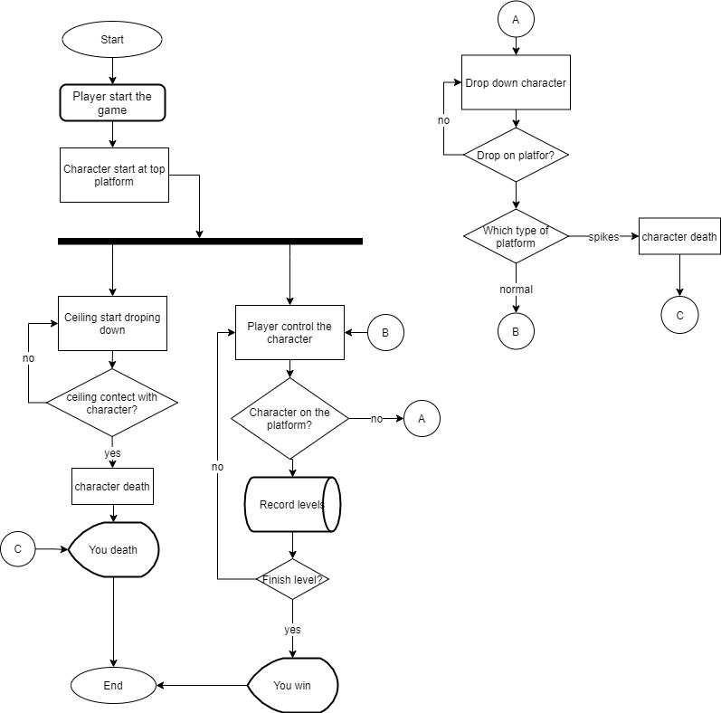

# 2D Unity Game
Go down stairs!

# How to play
Download the <a href="https://github.com/Nookada/Unity/raw/main/UserManual.7z" target="_blank">Usermanual.7z</a> and check out how to play this!
(Extract and run home.html)

# How to Download 
You can simply just download the <a href="https://github.com/Nookada/Unity/raw/main/Downstairs.7z " target="_blank">Downstairs.7z</a> in this repo

Or you can click the download button in the usermanual

Or you can just play it online!<a href="https://play.unity.com/mg/other/xiao-peng-you-xia-lou-ti" target="_blank">Click here</a>

# flowchart of the game 

Press the start that the program begins to execute. The character appears on the top platform and then starts to drop. 

During the descent, the system determines whether the character contacts the ceiling.

If the character contacts the ceiling, that character dies. If the character doesn’t touch the ceiling, the character continues to drop down. When character death, that the screen 
display “You death”, and program ends. During the descent, Player can control the character. 

The system determines whether the character on the platform, at the same time the system record levels. 

After record levels and the character is on any platform, the system determines that the character finish the level? 

If the character finishes the level screen display “You win”. 

If the character doesn’t finish level, Player continue to controls the character. 

When the system determines that the character doesn’t on any platform, that the system drop down the character. 

During the character drops, the system determines the character drop on any platform? If not, the system continues to drop down the character. 

If the character drop on platform, the system determines which type of platform is the character drop. 

If drop on normal platform that Player continue to controls the character. 

If drop on spikes platform, the character death and program ends.

